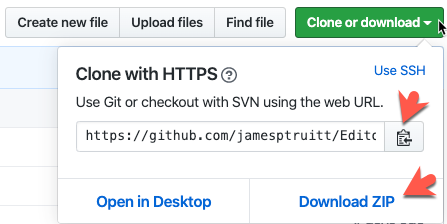

# Setting up AVID Editorial In The Cloud BYOL

This is a guide for setting up Avid Media workers on Windows VMs and Avid Nexis Linux servers on Azure. They are are a set of Terraform modules and install scripts so you will need to have some prerequisites in order to run the scripts. 

## Prerequisites

The first thing you will need to do is to get your machine prepped and ready.

You will need the following things installed on your system to get this up and running.

- Azure CLI [Azure CLI Directions](https://docs.microsoft.com/en-us/cli/azure/install-azure-cli?view=azure-cli-latest)
- Sign in  to Azure CLI
- [Terraform](https://learn.hashicorp.com/terraform/azure/install_az) skip past the suggestion to use the clould shell.
- [VSCode for Windows, Mac, or Linux](https://code.visualstudio.com/download) or other text editor (Vim, Sublime, etc...)
- A Command line interface 
  - Windows (Powershell, CMD) 
  - Mac (Terminal, ITerm )
- [GIT](https://git-scm.com/book/en/v2/Getting-Started-Installing-Git) Or you can download this repo as a zip file.


## Instructions

### Setting up your environment

Assuming that you have the prereqs above installed,first make sure you can sign in to your subscription on Azure using the Azure CLI by running az login from your console.  [Detailed Instructions here](https://docs.microsoft.com/en-us/cli/azure/authenticate-azure-cli?view=azure-cli-latest)

```console
> az login
```

Next, list the subscriptions you have access to on Azure.

```console
> az account list --query "[].{name:name, subscriptionId:id, tenantId:tenantId}"
```

This will give you a formated list of your subscriptions. Decide which subscrition to use, if there are more than one, and copy down the subscriptionId and tenantId, you will need these later.

If you have more than one subscription, set the Azure CLI to make sure it uses that subscription.

```console
> az account set --subscription="<Your subscriptionId>"
```

Now you can create the Service Principal that terraform will use to create resources in Azure. 

```console
> az ad sp create-for-rbac --role="Contributor" --scopes="/subscriptions/<Your subscriptionId>"
```

This will return an appId, password, sp_name,, and tenant. Copy down the appId and password for use later.

If you have not done so already, clone this repository.



```console
> git clone 
```

